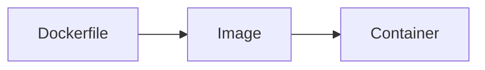

# Contributing Guide

Thanks for helping out. This guide covers how content is structured, how to add
it, and the code conventions if you are touching the site itself.

## How content is organised

Every documentation page is a **pair of files**:

```
docs/docker/images.md              ← the theory you write, free-form Markdown
docs/docker/images.cards.yaml      ← the questions drawn from that theory
```

- **Topic** = the first folder under `docs/` (`docker`)
- **Page** = the file name (`images`)

Pages can be grouped in subfolders and the topic stays the same:

```
docs/docker/networking/_category_.json     ← group label and position
docs/docker/networking/drivers.md          ← topic: docker, page: networking/drivers
docs/docker/networking/drivers.cards.yaml
```

Nothing needs registering. The navbar, sidebar, Revise topic list, homepage
counts and card data are all generated from this tree at build time.

### One card powers three modes

| Mode | Where | What it does |
|---|---|---|
| **Learn** | The topic page | Theory, then that page's questions as a collapsible list |
| **Revise** | `/revise` | Self-test one topic; grades build a spaced schedule |
| **Drill** | `/drill` | Timed, all topics mixed. Never touches the schedule. |

Write a card once and it appears in all three.

## Adding a page

1. Create `docs/<topic>/<page>.md`:

   ```markdown
   ---
   title: Images & Layers
   sidebar_position: 3
   displayed_sidebar: dockerSidebar
   description: One line for SEO and search results
   ---

   import TopicQA from '@site/src/components/TopicQA';

   # Images & Layers

   ## The one-sentence version

   The single idea the rest of the page builds on.

   ## Some concept {#some-concept}

   Explain it properly. Use tables, command examples and Mermaid diagrams.

   ## Questions

   <TopicQA />

   ## Learn more

   - [Official docs](https://example.com)
   ```

   `<TopicQA />` takes no props — it resolves its own topic and page from the
   file path, so it cannot drift out of sync.

2. Create `docs/<topic>/<page>.cards.yaml` with the questions.

3. Run `npm run content:check` to validate, then `npm start` to view.

### Writing the theory

The theory page is the part cards cannot replace. Aim for:

- **A one-sentence version at the top.** The single idea everything else hangs off.
- **Anchored sections** (`## Layers {#image-layers}`) so cards can link back.
- **Diagrams over paragraphs** where structure matters. Use Mermaid — it is text,
  so it diffs in review and needs no image files.
- **Tables for comparisons.** Merge vs rebase, TCP vs UDP, tier vs tier.
- **Real commands**, not pseudocode.
- **Why, not just what.** "Deleting a file in a later layer only hides it" is worth
  more than a list of instruction names.

Keep it yours. Condensed notes on what actually confused you beat a
comprehensive textbook nobody reads.

### Diagrams

Fence a Mermaid block like any code block:

````markdown

````

## Card schema

```yaml
- id: docker-images-layer-definition
  tier: core
  type: concept
  q: What creates a new layer in a Docker image?
  a: Any instruction that changes the filesystem — FROM, RUN, COPY, ADD.
  why: Optional elaboration, shown after the answer is revealed.
  tags: [docker, images, layers]
  verified: 2026-07-29
  ref: '#image-layers'
  version: '1.9'
  sources:
    - title: Docker Docs — Images
      url: https://docs.docker.com/get-started/docker-concepts/the-basics/what-is-an-image/
```

### Required fields

| Field | Format | Notes |
|---|---|---|
| `id` | `{topic}-{subtopic}-{slug}` | Unique forever. See below. |
| `tier` | `core` \| `deep` \| `trivia` | Importance |
| `type` | see table below | Card shape |
| `q` | string | One question, one fact |
| `a` | string | The shortest correct answer |
| `tags` | array | Free-form; include the topic name |
| `verified` | `YYYY-MM-DD` | When you last confirmed this is still true |

### Optional fields

| Field | Purpose |
|---|---|
| `why` | Elaboration shown after reveal |
| `ref` | Anchor on this page, e.g. `'#image-layers'`. Renders a "Read the theory" link in Revise and Drill. |
| `version` | Tool version the answer is true for |
| `sources` | List of `{ title, url }` — official docs preferred |
| `deprecated` | `true` retires a card without breaking saved progress |

### Never set these

`topic`, `page` and `pageUrl` are injected by the build from the file location.
The validator rejects them if authored by hand.

### Card types

| Type | Use for |
|---|---|
| `recall` | One atomic fact |
| `concept` | The mental model, not a detail |
| `elaborative` | A "why" or "how" question |
| `scenario` | Symptom to diagnosis. Where interviews actually live. |
| `cloze` | Fill the gap |
| `command` | "Write the command that does X" |

### Tiers

| Tier | Share | Meaning |
|---|---|---|
| `core` | ~60% | Every DevOps engineer should know this cold |
| `deep` | ~30% | Senior or specialist depth |
| `trivia` | ~10% | Real but rarely load-bearing. Excluded from drills by default. |

### IDs are permanent

An id is the key for a learner's saved review schedule. Once published:

- **Never reuse a deleted id for a different question.** Someone's progress would
  attach to the wrong card.
- **Do** keep the id when rewriting a question — progress carries over.
- Splitting one card into two? Retire the old id, create two new ones.

The build fails on duplicate ids across the whole repo.

## Writing good cards

The single most common mistake is putting several facts in one card. Split them.

```yaml
# Bad — one question, eight facts. Impossible to grade honestly.
- q: What is the Filesystem Hierarchy Standard?
  a: /etc is config, /var is logs, /tmp is temporary, /home is users, ...
```

```yaml
# Good — each fact recalled and scheduled on its own
- q: What does /etc hold?
  a: System-wide configuration files.
- q: What does /var hold?
  a: Variable data — logs, caches and spool files.
```

Checklist before opening a PR:

- [ ] One question, one fact
- [ ] The answer is the shortest correct phrasing
- [ ] `ref` points at a real anchor on the page
- [ ] `verified` is the date you actually checked it
- [ ] `sources` link to official docs, not blog posts
- [ ] `npm run content:check` passes

## Adding a topic

1. `docs/<topic>/_category_.json`:

   ```json
   {
     "label": "Ansible",
     "position": 10,
     "link": {
       "type": "generated-index",
       "description": "One line describing the topic."
     }
   }
   ```

2. Add your first page pair (above).

3. Optionally add a label and position in `site.config.js` under `topics`. Skipping
   this still works — the topic falls back to a title-cased folder name and sorts
   last.

A topic is worth publishing at roughly **20 core cards plus one theory page**.
Below about five cards per page they sit disconnected in memory and get failed
repeatedly, which is worse than not having them.

## CRUD operations

| Action | How | Effect on saved progress |
|---|---|---|
| Add | New block with a new id | None |
| Edit | Change any field, keep the id | Preserved |
| Delete | Remove the block | Orphan state is ignored harmlessly |
| Retire | Add `deprecated: true` | Preserved, card is skipped |

## Code conventions

If you are changing the site rather than the content:

**Configuration goes in `site.config.js`.** Site metadata, GitHub URLs, tiers,
card types, SM-2 tuning, grade labels and keyboard hints all live there. If a
value appears in two files, it belongs in config. Never hardcode a repo URL or a
tier name in a component.

**Layers, and which one to touch:**

| Layer | Files | Responsibility |
|---|---|---|
| Config | `site.config.js` | Every tunable value |
| Pipeline | `scripts/` | Parse, validate and emit card data |
| Data access | `src/lib/cardStore.js` | The only place that fetches card data |
| Domain | `src/lib/sm2.js`, `storage.js` | Scheduling and persistence, pure and testable |
| UI | `src/components/`, `src/pages/` | Presentation only |

Components must not `fetch()` directly — go through `cardStore`. That indirection
is why the on-disk data layout can change without touching the UI.

**Other conventions:**

- JSDoc on exported functions, with a note on *why* when the reason is not obvious
- No magic numbers or strings; import them from config
- Comments explain reasoning, not mechanics
- Shared card UI lives in `CardBadges` and `CardAnswer` so the three modes cannot drift
- Keyboard support and `aria-*` attributes on anything interactive
- Every page must work at 360px wide

## Local development

```bash
npm install
npm start             # dev server with hot reload
npm run content:check # validate cards without a full build
npm run build         # production build
npm run serve         # serve the production build
```

## Branching

Work on `stg`, then open a PR into `main`. Pushing to `main` deploys to
production automatically; pushing to `stg` does not.

## Reporting problems

- **Wrong answer** — open an issue with the card id
- **Out of date** — include the correct value and the version you checked
- **Badly formulated** — suggest a rewrite; multi-fact cards are always worth splitting
