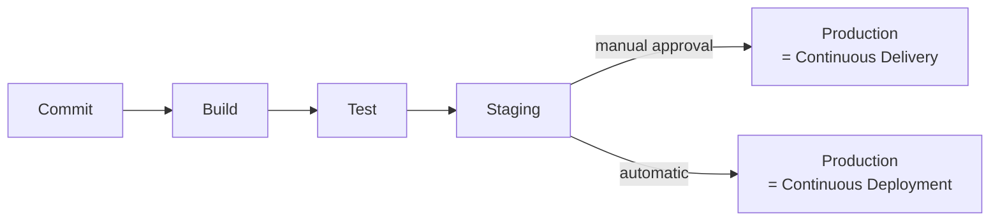
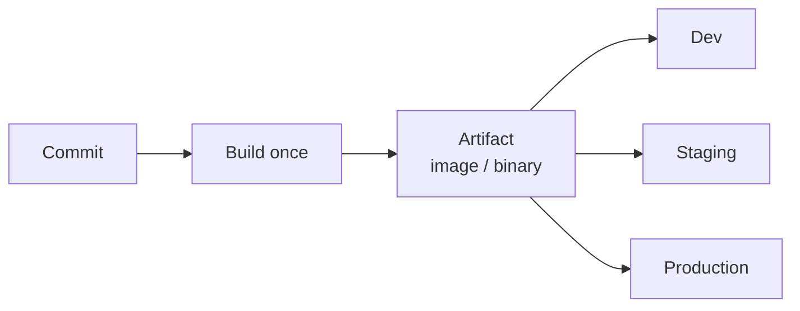
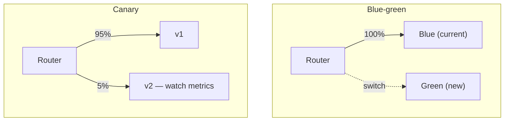

import TopicQA from '@site/src/components/TopicQA';

# CI/CD Pipelines

## The one-sentence version

A pipeline turns a commit into a deployable artifact and then into running
software, with automated checks at each step so failures are caught early and
cheaply.

## CI, delivery, deployment {#ci-cd-definitions}

Three terms that get used interchangeably and should not be.

| Term | Means |
|---|---|
| Continuous Integration | Every push is automatically built and tested |
| Continuous **Delivery** | Always deployable; production release is a manual decision |
| Continuous **Deployment** | Every passing change goes to production automatically |

The distinction that matters in an interview: delivery keeps a human gate,
deployment does not.

## Build once, promote the artifact {#artifacts}

The most important pipeline principle, and the one most often broken.

Build the artifact **once** and promote that same artifact through environments.
Rebuilding per environment means the thing you tested is not the thing you shipped
— dependency resolution, base images and build tooling can all differ between runs.

This also makes rollback trivial: redeploy the previous artifact. If you instead
rebuild from an old commit, you are hoping the build is reproducible under pressure.

## Deployment strategies {#strategies}

Each trades infrastructure cost against rollback speed and risk exposure.

| Strategy | How | Rollback | Cost |
|---|---|---|---|
| Rolling | Replace instances in batches | Slow — roll forward again | None extra |
| Blue-green | Two full environments, switch traffic | Instant — switch back | 2x infrastructure |
| Canary | Send a small % of traffic to the new version | Fast — stop shifting | Slight |
| Recreate | Stop all, start new | Redeploy | Downtime |

Canary is the strongest option when you have real observability, because it limits
the blast radius of a bad release to a fraction of users and gives you metrics to
decide on. Without monitoring to watch, a canary is just a slower rolling deploy.

## Secrets and safety {#secrets}

Pipelines run with credentials to your infrastructure, which makes them a serious
target.

- Store secrets in the platform's encrypted store, never in the YAML
- Prefer short-lived credentials via OIDC over long-lived static keys
- Do not expose secrets to workflows triggered by pull requests from forks
- Pin third-party actions to a commit SHA, not a mutable tag

That last one matters: a tag like `@v3` can be repointed by the action's owner, so
a compromised upstream becomes code execution inside your pipeline with your
credentials.

## Why it passes locally and fails in CI {#local-vs-ci}

A near-universal experience, and the causes are a short list:

| Cause | Check |
|---|---|
| Different runtime version | Pin it explicitly in the workflow |
| Missing environment variable | Compare local env against pipeline config |
| Uncommitted local file | `git status` — CI only has what you pushed |
| Stale cache | Clear the dependency cache and retry |
| Case-sensitive filesystem | Linux CI vs case-insensitive macOS |

The last one bites regularly: `import ./Utils` works on macOS and fails on a Linux
runner.

## Questions

<TopicQA />

## Learn more

- [Martin Fowler — Continuous Integration](https://martinfowler.com/articles/continuousIntegration.html)
- [GitHub Actions — Workflow syntax](https://docs.github.com/en/actions/writing-workflows/workflow-syntax-for-github-actions)
- [GitHub Actions — Security hardening](https://docs.github.com/en/actions/security-for-github-actions/security-guides/security-hardening-for-github-actions)
- [Atlassian — CI vs delivery vs deployment](https://www.atlassian.com/continuous-delivery/principles/continuous-integration-vs-delivery-vs-deployment)
