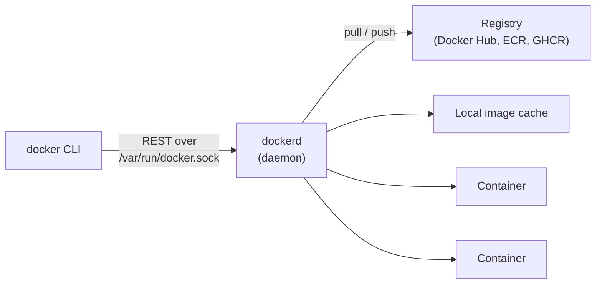
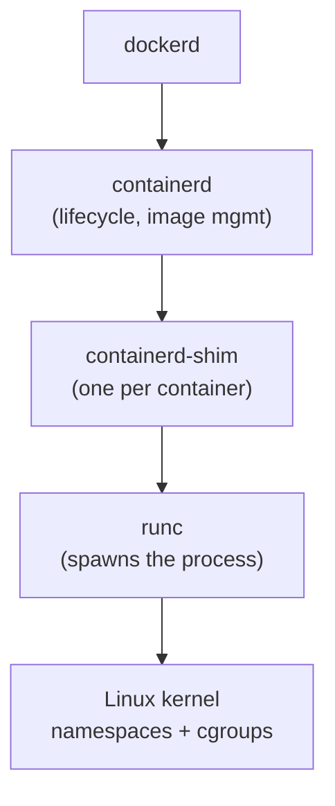
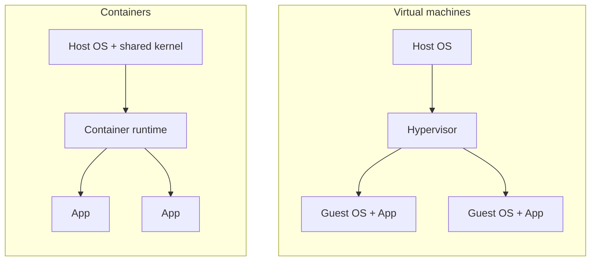

import TopicQA from '@site/src/components/TopicQA';

# Docker Architecture

## The one-sentence version

Docker is a client/server system: the CLI sends REST calls to a long-running
daemon, and the daemon delegates the actual container creation to lower-level
runtimes that lean on two Linux kernel features — **namespaces** for isolation
and **cgroups** for resource limits.

## Client, daemon, registry {#client-daemon-registry}

Three moving parts. Nearly every "why did that happen" question traces back to
which one was responsible.

| Component | Runs where | Responsibility |
|---|---|---|
| `docker` CLI | Your shell | Formats requests. Holds no state. |
| `dockerd` | Host, as root | Builds images, manages containers, networks, volumes |
| Registry | Remote | Stores and distributes images |

The CLI being stateless is why `docker ps` on a remote host works just by
pointing `DOCKER_HOST` elsewhere — nothing about your containers lives in the
client.

It is also the answer to a common security question: the daemon runs as root and
its socket is effectively root access. Anyone in the `docker` group can mount the
host filesystem into a container and escape. That is not a bug, it is the
consequence of the architecture.

## Below the daemon {#runtime-stack}

`dockerd` does not create containers itself. It hands off down a chain:

The **shim** is the part worth understanding. One shim process exists per
container and owns its stdio and exit code. Because the shim — not the daemon —
is the container's parent, you can restart `dockerd` without killing running
containers.

`runc` is the piece that actually implements the OCI runtime spec. It sets up the
namespaces, applies the cgroup limits, then execs your process and exits. There
is no Docker process wrapping your app at runtime.

## Isolation is a kernel feature {#namespaces-cgroups}

A container is a normal Linux process with a restricted view of the system. There
is no container object in the kernel.

**Namespaces** answer "what can this process see":

| Namespace | Isolates |
|---|---|
| `pid` | Process IDs — your app sees itself as PID 1 |
| `net` | Interfaces, routes, ports |
| `mnt` | Filesystem mount points |
| `uts` | Hostname |
| `ipc` | Shared memory, semaphores |
| `user` | UID/GID mapping |

**cgroups** answer "how much can it use" — CPU shares, memory ceilings, block
I/O, process counts.

This is why containers start in milliseconds while VMs take tens of seconds:
there is no guest kernel to boot and no hardware to emulate. It is also why a
Linux container cannot run on a Windows kernel without a Linux VM underneath —
the isolation primitives are kernel-specific.

## Container vs virtual machine {#container-vs-vm}

The tradeoff is isolation strength for density and speed. A VM has a hardware
boundary; a container shares the kernel, so a kernel vulnerability is a shared
blast radius. That is the reason regulated workloads sometimes still require VMs,
or a sandboxed runtime like gVisor or Kata.

## Questions

<TopicQA />

## Learn more

- [Docker Docs — Architecture](https://docs.docker.com/get-started/docker-overview/)
- [OCI Runtime Specification](https://github.com/opencontainers/runtime-spec/blob/main/spec.md)
- [man 7 namespaces](https://man7.org/linux/man-pages/man7/namespaces.7.html)
- [man 7 cgroups](https://man7.org/linux/man-pages/man7/cgroups.7.html)
