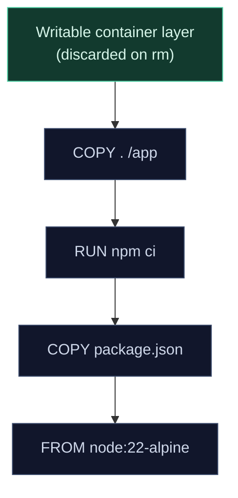

import TopicQA from '@site/src/components/TopicQA';

# Images & Layers

## The one-sentence version

An image is a stack of read-only layers plus a manifest; a container is that
stack with one thin writable layer on top. Almost every practical Docker skill —
fast builds, small images, understanding why data vanished — falls out of that
one fact.

## Layers and the union filesystem {#image-layers}

Each instruction that changes the filesystem (`FROM`, `RUN`, `COPY`, `ADD`)
produces a new layer. A storage driver such as `overlay2` unions them into a
single view.



Two consequences that come up constantly:

**Layers are shared.** Ten containers from the same image do not copy it ten
times. They share the read-only layers and each gets its own writable layer. This
is why a hundred containers can share one 200 MB image.

**Layers are immutable and additive.** Deleting a file in a later layer only
hides it — the bytes remain in the earlier layer. So this does *not* shrink the
image:

```dockerfile
RUN curl -O https://example.com/big.tar.gz
RUN tar -xzf big.tar.gz && rm big.tar.gz   # big.tar.gz still ships
```

Do the work and the cleanup in one layer instead:

```dockerfile
RUN curl -O https://example.com/big.tar.gz \
 && tar -xzf big.tar.gz \
 && rm big.tar.gz
```

## Why instruction order decides build speed {#build-cache}

Docker reuses a cached layer only if that instruction and every instruction
before it are unchanged. One early change invalidates everything after it.

```dockerfile
# Slow: any source edit reinstalls all dependencies
FROM node:22-alpine
WORKDIR /app
COPY . .
RUN npm ci
```

```dockerfile
# Fast: dependencies re-install only when the manifest changes
FROM node:22-alpine
WORKDIR /app
COPY package.json package-lock.json ./
RUN npm ci
COPY . .
```

The rule: **order instructions from least to most frequently changing.** Your
source code changes every commit, your dependency manifest rarely, your base
image almost never.

## Multi-stage builds {#multi-stage}

Build tooling is needed to produce an artifact but not to run it. Multi-stage
builds let you discard it.

```dockerfile
FROM golang:1.23 AS build
WORKDIR /src
COPY . .
RUN CGO_ENABLED=0 go build -o /out/api ./cmd/api

FROM gcr.io/distroless/static:nonroot
COPY --from=build /out/api /api
USER nonroot
ENTRYPOINT ["/api"]
```

Only the final stage ships. The Go toolchain, source and module cache are left
behind — often turning an 800 MB image into 15 MB. Smaller images pull faster and
carry far less CVE surface, which is a security win as much as a size one.

## Tags are pointers, not versions {#tags-digests}

A tag is a mutable label. `node:22` today and `node:22` next month can be
different images. Only the digest is immutable:

```bash
docker pull node:22@sha256:2a4e0b...   # exactly one image, forever
```

| Reference | Stability |
|---|---|
| `myapp:latest` | None. Just a default tag name with no special meaning. |
| `myapp:1.4` | Moves with patch releases |
| `myapp@sha256:...` | Immutable |

Pin digests where reproducibility matters — base images in production builds and
CI. `latest` in a production manifest is how you get a deploy that cannot be
reproduced.

## Questions

<TopicQA />

## Learn more

- [Docker Docs — Images](https://docs.docker.com/get-started/docker-concepts/the-basics/what-is-an-image/)
- [Docker Docs — Build cache](https://docs.docker.com/build/cache/)
- [Docker Docs — Multi-stage builds](https://docs.docker.com/build/building/multi-stage/)
- [Docker Docs — Storage drivers](https://docs.docker.com/engine/storage/drivers/)
