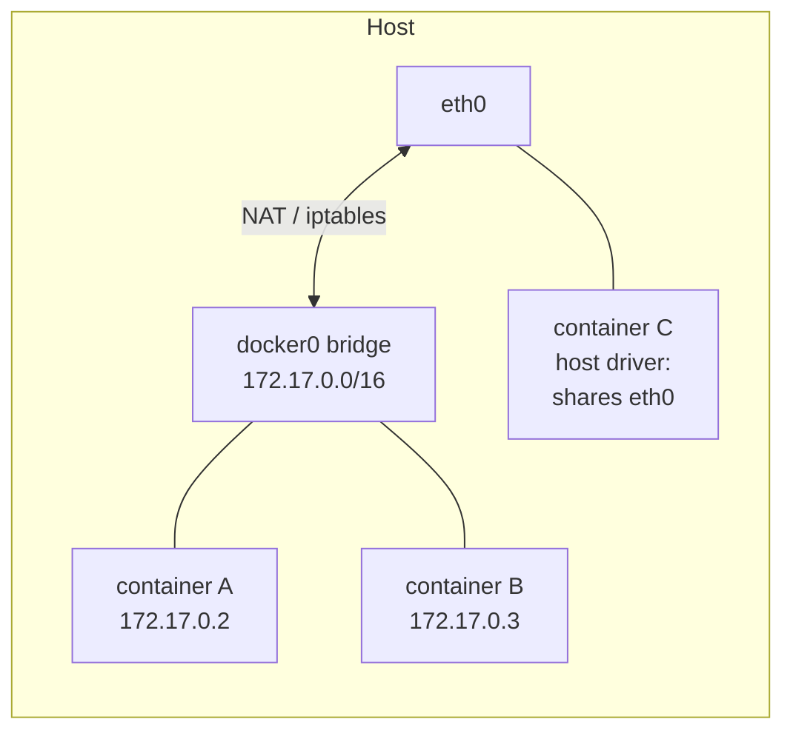

import TopicQA from '@site/src/components/TopicQA';

# Network Drivers

## The one-sentence version

A Docker network driver decides what a container's `net` namespace looks like —
whether it gets its own isolated stack behind a NAT (`bridge`), shares the host's
stack outright (`host`), or spans multiple hosts (`overlay`).

## The drivers you actually use {#drivers}

| Driver | Container gets | Use when |
|---|---|---|
| `bridge` | Private IP on a virtual switch, NAT to outside | Default. Single-host apps. |
| `host` | The host's network stack directly | You need raw performance or host-level port access |
| `none` | Loopback only | Batch jobs that must not reach the network |
| `overlay` | Address on a network spanning hosts | Swarm / multi-host clusters |
| `macvlan` | A MAC address on the physical LAN | Legacy apps that must look like a physical host |



## The default bridge is not the one you want {#user-defined-bridge}

Containers on the built-in `bridge` network can reach each other by IP, but **not
by name**. A user-defined bridge adds an embedded DNS resolver, so containers
resolve each other by container name.

```bash
docker network create app-net
docker run -d --name db  --network app-net postgres:17
docker run -d --name api --network app-net myapi   # can reach "db"
```

This is the single most common Docker networking gotcha: two containers started
without `--network` cannot find each other by name, and the fix is a user-defined
network rather than hardcoding IPs (which change on restart).

## Publishing ports {#publishing-ports}

`EXPOSE` in a Dockerfile is documentation only. Nothing is reachable from outside
until you publish at run time:

```bash
docker run -p 8080:80 nginx     # host:8080 -> container:80
docker run -p 127.0.0.1:8080:80 nginx   # bind to loopback only
```

Omitting the host interface binds `0.0.0.0`, which on a cloud VM means the port is
world-reachable if the firewall or security group allows it. Docker writes
`iptables` rules directly and can therefore bypass some host firewall
configurations — worth knowing before assuming `ufw` is protecting you.

## Questions

<TopicQA />

## Learn more

- [Docker Docs — Networking overview](https://docs.docker.com/engine/network/)
- [Docker Docs — Bridge networks](https://docs.docker.com/engine/network/drivers/bridge/)
- [Docker Docs — Packet filtering and firewalls](https://docs.docker.com/engine/network/packet-filtering-firewalls/)
