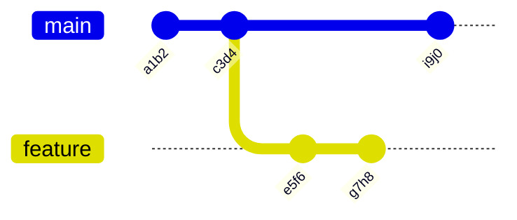
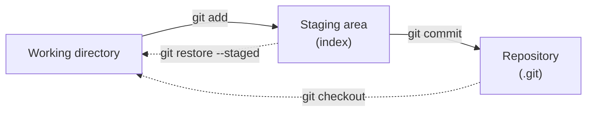
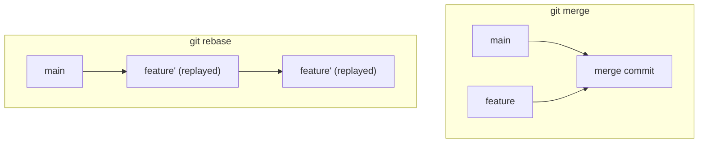

import TopicQA from '@site/src/components/TopicQA';

# Git Fundamentals

## The one-sentence version

Git stores **snapshots** in a directed acyclic graph of commits, and a branch is
nothing more than a movable pointer into that graph — which is why branching is
instant and why "rewriting history" is a real and dangerous operation.

## The commit graph {#commit-graph}

Each commit points to a tree (a full snapshot of tracked files) and to its
parent. Branches and `HEAD` are just labels.



| Thing | Really is |
|---|---|
| Commit | Snapshot + metadata + parent pointer(s) |
| Branch | A file containing one commit SHA |
| `HEAD` | A pointer to the current branch |
| Tag | A fixed pointer to one commit |

Creating a branch writes a 41-byte file. That is the whole operation — no copying,
which is why Git branching is effectively free compared to older VCSes.

## The three areas {#three-areas}

Git has an extra stage that most version control does not, and it exists so you
can craft a commit deliberately rather than committing whatever happens to be on
disk.



This is what makes `git add -p` possible: stage one hunk of a file, commit it, and
leave the rest of your changes for a separate commit.

## Merge vs rebase {#merge-vs-rebase}

Both integrate one branch into another. They differ in what history you end up
with.



| | Merge | Rebase |
|---|---|---|
| History | Preserved, with a merge commit | Linear, commits rewritten |
| Original commits | Kept | Replaced by new SHAs |
| Safe on shared branches | Yes | **No** |

**The rule: never rebase commits that others have pulled.** Rebase creates new
commits with new SHAs, so anyone who already has the old ones now has a divergent
history, and their next pull produces a mess.

## Undoing things {#undo}

The two commands people mix up, with very different consequences.

| | `git revert` | `git reset` |
|---|---|---|
| Mechanism | New commit that inverts a previous one | Moves the branch pointer backwards |
| History | Preserved | Rewritten |
| Safe on shared branches | Yes | No |

```bash
git revert <sha>          # safe on main: adds an inverse commit
git reset --soft HEAD~1   # undo commit, keep changes staged
git reset --hard HEAD~1   # undo commit, discard changes  <- destructive
```

`--hard` discards uncommitted work with no prompt and no easy recovery. It is the
one Git command worth pausing over.

## Recovering from mistakes {#reflog}

Almost nothing is truly lost. `git reflog` records where `HEAD` has been, so a
"lost" commit after a bad reset is usually still reachable:

```bash
git reflog                 # find the SHA you were on
git checkout -b rescue <sha>
```

The same applies to commits made in detached `HEAD` state — create a branch at
that commit and they are safe from garbage collection.

## Questions

<TopicQA />

## Learn more

- [Pro Git — Git Basics](https://git-scm.com/book/en/v2/Getting-Started-Git-Basics)
- [Pro Git — Branching in a Nutshell](https://git-scm.com/book/en/v2/Git-Branching-Branches-in-a-Nutshell)
- [Pro Git — Rewriting History](https://git-scm.com/book/en/v2/Git-Tools-Rewriting-History)
- [Atlassian — Comparing workflows](https://www.atlassian.com/git/tutorials/comparing-workflows)
