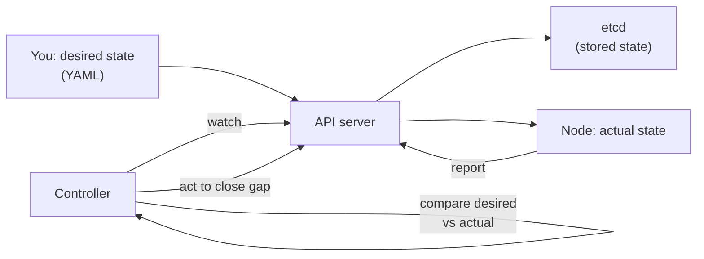
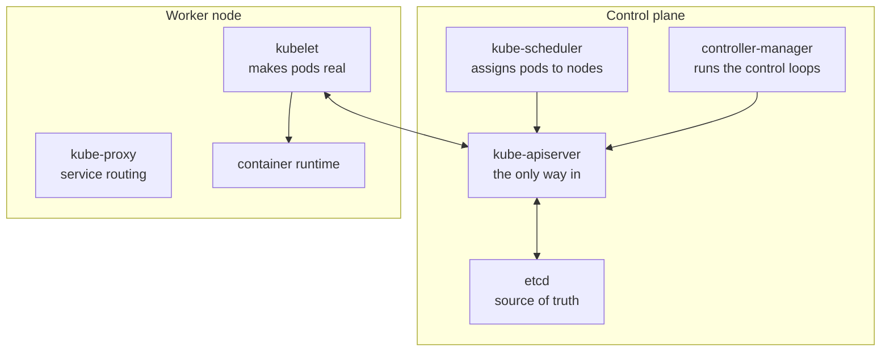
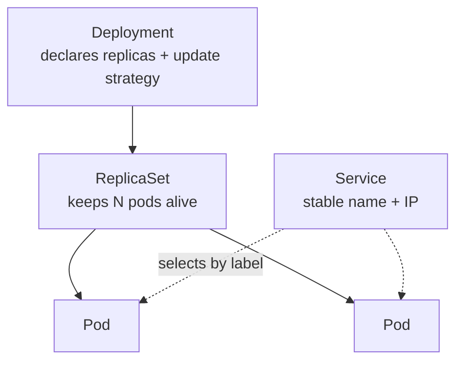

import TopicQA from '@site/src/components/TopicQA';

# Kubernetes Architecture

## The one-sentence version

Kubernetes is a **reconciliation engine**: you declare desired state, controllers
continuously compare it against actual state, and act to close the gap.

Everything else is a consequence of that loop.

## The control loop {#reconciliation}

This is the idea that makes the rest of Kubernetes make sense.

You never tell Kubernetes to *do* something. You tell it what should be true, and
a controller works continuously to make it so. Delete a pod managed by a
Deployment and it comes back — not because deletion failed, but because actual
state no longer matched desired state.

## Control plane vs nodes {#components}

| Component | Job |
|---|---|
| `kube-apiserver` | Validates and persists all state. Everything talks through it. |
| `etcd` | Distributed key-value store — the single source of truth |
| `kube-scheduler` | Picks a node for each unassigned pod |
| `controller-manager` | Runs the reconciliation loops |
| `kubelet` | Node agent; ensures its assigned pods are running |
| `kube-proxy` | Implements Service networking on the node |

Two things follow from this shape. The API server is the only component that talks
to etcd, which is why it is the security boundary worth hardening. And because the
kubelet reports in rather than being pushed to, a node losing contact does not stop
its containers — they keep running while the control plane marks the node
`NotReady`.

## The workload hierarchy {#workloads}

| Object | Guarantees |
|---|---|
| Pod | One or more containers sharing a network namespace and volumes |
| ReplicaSet | Exactly N identical pods exist |
| Deployment | Manages ReplicaSets; rolling updates and rollbacks |
| StatefulSet | Stable identity, stable storage, ordered startup |
| Service | A stable address for a changing set of pods |

Pods are **ephemeral** — they get new names and new IPs constantly. That is
precisely why Services exist: a Service is a fixed name and IP that selects pods
by label, so callers never need to know which pods exist right now.

## Service types {#service-types}

Each type builds on the previous one.

| Type | Reachable from | Mechanism |
|---|---|---|
| `ClusterIP` | Inside the cluster only | Virtual IP, load-balanced by kube-proxy |
| `NodePort` | Outside, via any node IP | ClusterIP + a fixed port on every node |
| `LoadBalancer` | Outside, via a cloud LB | NodePort + a provisioned external LB |

For HTTP specifically an **Ingress** is usually the answer instead — one load
balancer with host and path routing plus TLS termination, rather than one cloud
load balancer per service. Ingress does nothing on its own; it needs a controller
such as nginx or Traefik running in the cluster.

## Health probes {#probes}

Two probes with different consequences, and mixing them up causes outages.

| Probe | Question | On failure |
|---|---|---|
| `readiness` | Can this pod serve traffic yet? | Removed from Service endpoints |
| `liveness` | Is this pod still functioning? | Container is **restarted** |
| `startup` | Has it finished booting? | Delays the other probes |

A liveness probe that is too aggressive on a slow-starting app produces a restart
loop: the app never finishes booting before being killed. That is what `startup`
probes exist to prevent.

## Questions

<TopicQA />

## Learn more

- [Kubernetes — Cluster architecture](https://kubernetes.io/docs/concepts/architecture/)
- [Kubernetes — Workloads](https://kubernetes.io/docs/concepts/workloads/)
- [Kubernetes — Service](https://kubernetes.io/docs/concepts/services-networking/service/)
- [Kubernetes — Liveness, readiness and startup probes](https://kubernetes.io/docs/concepts/configuration/liveness-readiness-startup-probes/)
