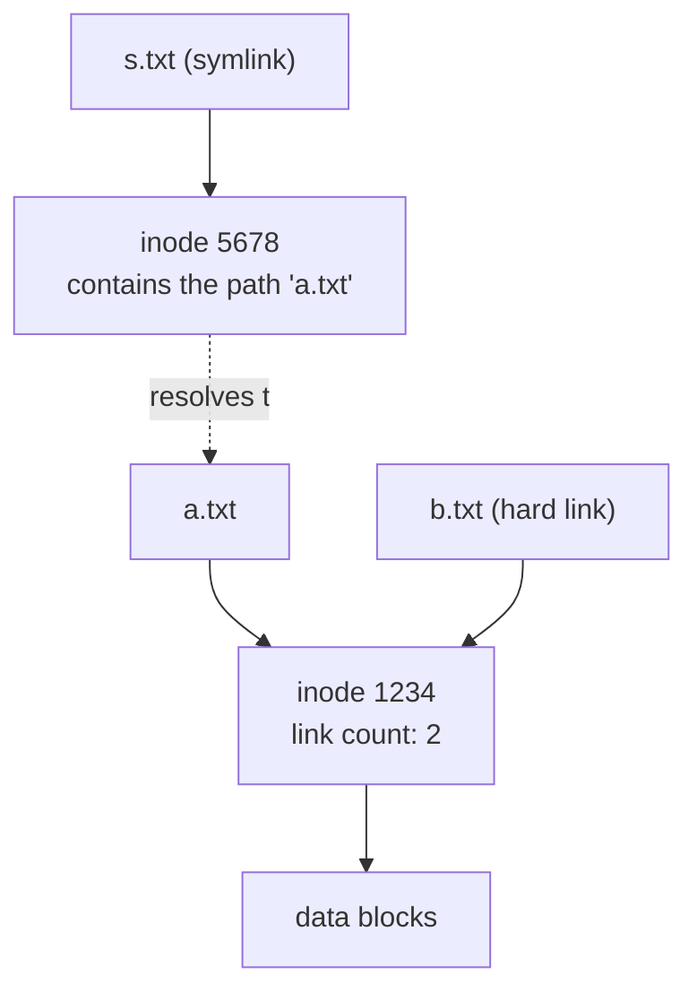

import TopicQA from '@site/src/components/TopicQA';

# Linux Filesystem

## The one-sentence version

Linux presents everything as one tree rooted at `/`, where the **name** of a file
and the **file itself** are separate things — directory entries hold names,
inodes hold the file.

## The directory layout {#fhs}

The Filesystem Hierarchy Standard assigns meaning to each top-level directory so
software and administrators can predict paths across distributions.

| Path | Holds |
|---|---|
| `/etc` | System-wide configuration |
| `/var` | Variable data — logs, caches, spool |
| `/tmp` | Temporary files, typically cleared on reboot |
| `/home` | User home directories |
| `/usr` | User programs, libraries, read-only data |
| `/proc` | Virtual filesystem exposing kernel and process state |
| `/dev` | Device nodes |

`/bin` versus `/usr/bin` is a historical artifact worth knowing. `/bin` held the
binaries needed to boot into single-user mode, back when `/usr` might live on a
separate or network-mounted partition unavailable that early. That constraint is
gone, so modern distributions symlink `/bin` to `/usr/bin`.

## Names, inodes, and data {#inodes}

A file has three distinct parts, and separating them explains a surprising amount
of behaviour.


The inode stores everything about a file **except** its name and its contents.
The name lives in the directory entry that points at the inode.

```bash
ls -i file.txt      # show the inode number
stat file.txt       # show the full inode contents
df -i               # inode usage per filesystem
```

## Hard links vs symbolic links {#links}

This distinction falls straight out of the model above.



| | Hard link | Symbolic link |
|---|---|---|
| Own inode | No — shares the target's | Yes |
| Contents | N/A | A path string |
| Survives target rename | Yes | No, becomes dangling |
| Can cross filesystems | No | Yes |
| Can point at a directory | No (generally) | Yes |

A file's data is freed when its inode link count reaches zero. That is why
deleting one of two hard links does not lose the data, and why deleting a file
that a running process still holds open frees nothing until the process exits.

## When the disk is full but isn't {#inode-exhaustion}

A classic incident. Writes fail with `No space left on device`, but `df -h` shows
plenty of free space.

```bash
df -h    # bytes:  20% used
df -i    # inodes: 100% used   <- the actual problem
```

Every file consumes an inode regardless of size, and the count is fixed at
filesystem creation. Millions of tiny files — session data, unrotated logs, cache
entries — exhaust inodes long before they exhaust bytes.

## Questions

<TopicQA />

## Learn more

- [Filesystem Hierarchy Standard 3.0](https://refspecs.linuxfoundation.org/FHS_3.0/fhs-3.0.html)
- [man 7 inode](https://man7.org/linux/man-pages/man7/inode.7.html)
- [man 1 ln](https://man7.org/linux/man-pages/man1/ln.1.html)
- [Red Hat — Managing file systems](https://docs.redhat.com/en/documentation/red_hat_enterprise_linux/9/html/managing_file_systems/index)
