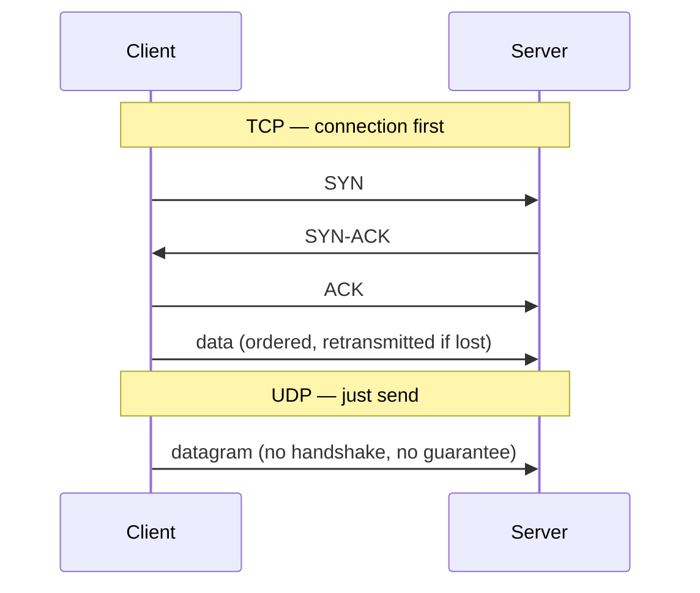
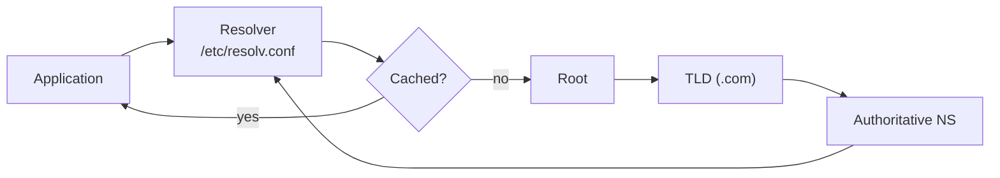

import TopicQA from '@site/src/components/TopicQA';

# Networking Fundamentals

## The one-sentence version

Network traffic is built in layers — each one wraps the one above it — and almost
all troubleshooting is the act of working out **which layer** is broken.

## The layer model {#layers}

The OSI model has seven layers; in practice you reason about four.

| OSI | Name | Carries | You debug it with |
|---|---|---|---|
| 7 | Application | HTTP, DNS, SSH | `curl`, `dig` |
| 4 | Transport | TCP, UDP — ports | `ss`, `nc`, `telnet` |
| 3 | Network | IP — routing | `ping`, `ip route`, `traceroute` |
| 2 | Data link | MAC, switching | `ip link`, `arp` |

The practical value is a debugging order. "The site is down" becomes a sequence:
does the name resolve (7), does the port accept a connection (4), does the host
answer at all (3)? Working bottom-up finds the real fault far faster than guessing.

## TCP vs UDP {#tcp-udp}

Both are layer 4. They make opposite tradeoffs.

| | TCP | UDP |
|---|---|---|
| Connection | Three-way handshake | None |
| Delivery | Guaranteed, ordered | Best effort |
| Overhead | Higher | Minimal |
| Used by | HTTP, SSH, database protocols | DNS queries, streaming, VoIP |

UDP is chosen when late data is worse than missing data. A dropped frame in a
video call should be skipped, not retransmitted three seconds later.

## DNS resolution {#dns}

DNS turns a name into an address, and it is the first thing to suspect when
something works by IP but not by hostname.

| Record | Maps to |
|---|---|
| `A` | IPv4 address |
| `AAAA` | IPv6 address |
| `CNAME` | Another name (never an IP) |
| MX | Mail servers |
| TXT | Arbitrary text — SPF, domain verification |

TTL is the cache lifetime. It is why a DNS change is not instant, and why you drop
TTL *before* a planned migration rather than during it.

## HTTP status codes {#http-status}

The first digit is the whole story, and it tells you who is at fault.

| Class | Meaning | Whose problem |
|---|---|---|
| `2xx` | Success | — |
| `3xx` | Redirect | — |
| `4xx` | Client error | The request |
| `5xx` | Server error | The server |

Worth knowing precisely: `401` means not authenticated, `403` means authenticated
but not permitted, `502` means a gateway got a bad response from upstream, and
`504` means upstream did not answer in time. In a load-balanced system, `502` and
`504` usually point past the proxy to the backend.

## Addressing {#addressing}

CIDR notation states how many leading bits are the network portion.

| CIDR | Usable hosts |
|---|---|
| `/24` | 254 |
| `/16` | 65,534 |
| `/32` | 1 (a single host) |

Two of the total are unusable: the network address and the broadcast address.

The RFC 1918 private ranges — `10.0.0.0/8`, `172.16.0.0/12`, `192.168.0.0/16` —
are not routable on the public internet, which is why NAT exists: it translates
many private addresses onto one public one on the way out.

## Questions

<TopicQA />

## Learn more

- [Cloudflare — What is the OSI Model?](https://www.cloudflare.com/learning/ddos/glossary/open-systems-interconnection-model-osi/)
- [Cloudflare — What is DNS?](https://www.cloudflare.com/learning/dns/what-is-dns/)
- [MDN — HTTP response status codes](https://developer.mozilla.org/en-US/docs/Web/HTTP/Status)
- [RFC 1918 — Private address allocation](https://datatracker.ietf.org/doc/html/rfc1918)
