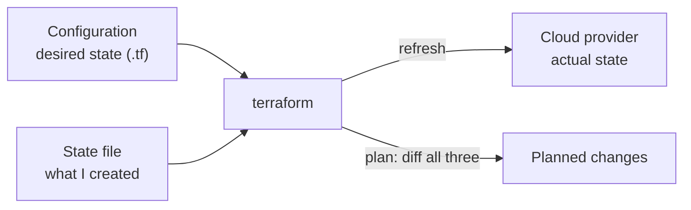
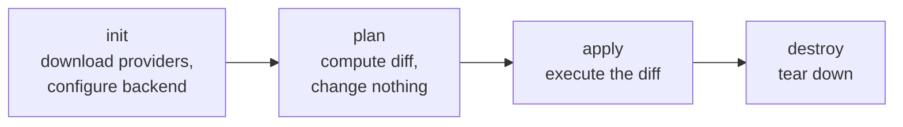

import TopicQA from '@site/src/components/TopicQA';

# State & Workflow

## The one-sentence version

Terraform keeps a **state file** mapping your configuration to real cloud
resources, and every command is some variation of "compare config to state to
reality, then reconcile".

Understanding state explains nearly every confusing thing Terraform does.

## Why state exists {#state}

Terraform is declarative — you describe the end result. To know whether a resource
already exists, it needs a record linking a config block to a real resource ID.

Without state, Terraform could not tell "create this server" from "this server
already exists", and every `apply` would create duplicates.

Two consequences worth internalising:

**State is sensitive.** It records resource attributes in plain text, including
generated passwords and connection strings. It must never be committed to Git.

**Losing state means losing track, not losing resources.** The infrastructure keeps
running; Terraform simply no longer knows it owns it. Recovery means importing
resources back one at a time — tedious enough that remote state with versioning is
non-negotiable in production.

## Remote backends and locking {#backends}

Local state works for one person on one machine. Beyond that you need a remote
backend.

| Backend | Locking via |
|---|---|
| S3 | DynamoDB table (or S3 native locking) |
| Terraform Cloud | Built in |
| Azure Blob Storage | Blob lease |
| GCS | Built in |

Locking is the part people skip and regret. Two concurrent `apply` runs against the
same state produce interleaved writes and a corrupted state file. A lock makes the
second run wait.

## The workflow {#workflow}

`plan` is read-only. It refreshes state against the provider, diffs against your
config, and prints what it *would* do. Reading plan output carefully is the single
highest-value Terraform habit — it is the last checkpoint before production
changes.

| Symbol | Action |
|---|---|
| `+` | Create |
| `~` | Update in place |
| `-` | Destroy |
| `-/+` | **Replace** — destroy then create |

`-/+` deserves attention. Some attribute changes cannot be updated in place, so
Terraform destroys and recreates. On a database that means data loss. Always check
whether a plan is replacing something you cannot afford to lose.

## Idempotency and drift {#drift}

Running `apply` twice with no config change does nothing the second time — that is
idempotency, and it comes from diffing rather than executing blindly.

**Drift** is when reality diverges from state because someone changed a resource
outside Terraform. The next `plan` shows unexpected changes as Terraform tries to
pull reality back to your configuration. This is the argument against mixing manual
console edits with managed infrastructure: Terraform will faithfully undo them.

## Questions

<TopicQA />

## Learn more

- [Terraform — State](https://developer.hashicorp.com/terraform/language/state)
- [Terraform — Backends](https://developer.hashicorp.com/terraform/language/backend)
- [Terraform — State locking](https://developer.hashicorp.com/terraform/language/state/locking)
- [Terraform — Command: plan](https://developer.hashicorp.com/terraform/cli/commands/plan)
